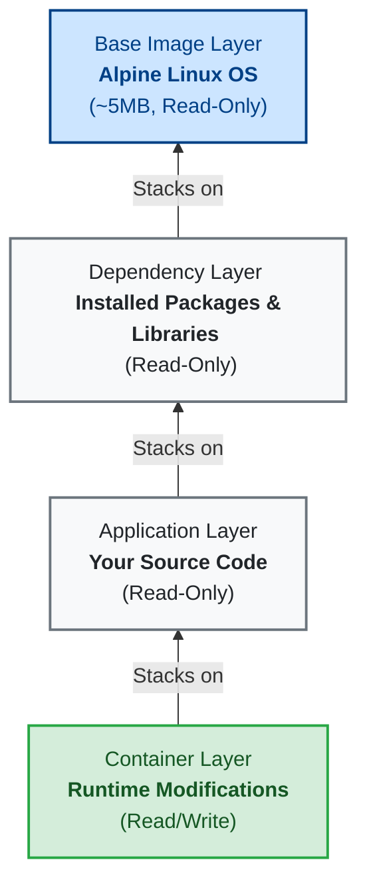

# My Docker Learning Notes
These are my notes as I learn Docker.

## What is Docker?
Docker is an open-source platform that enables developers to build, deploy, run, update, and manage containers. Containers are standardized, executable components that combine application source code with the operating system (OS) libraries and dependencies required to run that code in any environment.

In simpler terms, Docker allows you to package an application and all its dependencies into a single, isolated unit called a container. This ensures that the application runs identically regardless of where the container is deployed (e.g., on a developer's local laptop, a testing server, or in the cloud), eliminating the classic "it works on my machine" problem.

## Images vs. Containers
It is important to understand the fundamental difference between a Docker **Image** and a Docker **Container**:

* **Docker Image:** Think of an image as a **blueprint** or a recipe. It is a static, read-only file that contains the application source code, libraries, dependencies, tools, and other files needed for the application to run. You don't "run" an image directly; instead, you use it to create containers.
* **Docker Container:** A container is the **running instance** of an image. Simply put, **a Docker container is a runtime environment for a Docker image**. If the image is the blueprint, the container is the actual house built from that blueprint. A container has state—it can be started, stopped, paused, and destroyed. You can run multiple containers simultaneously from a single image.

## Docker vs. Virtual Machines (VMs)
While both Docker and VMs provide isolation, they achieve it in fundamentally different ways based on their architectural stack:

* **The Virtual Machine Stack:** `Hardware -> Host OS -> Hypervisor -> Guest OS (Kernel) -> Application`
  * A VM requires a full, heavy **Guest Operating System (kernel)** to be installed and booted for every isolated environment. A VM completely virtualizes the hardware and changing the VM means you are dealing with a completely separate kernel.
* **The Docker Stack:** `Hardware -> Host OS (Kernel) -> Docker Engine -> Application`
  * Docker **shares the host OS kernel** across all running containers. It only virtualizes and isolates the **application layer** (your app code and its specific dependencies). Because it doesn't need to boot a separate kernel for every app, Docker is significantly faster, more lightweight, and uses far less memory than a VM.

## Docker Toolbox
**What is it?** Docker Toolbox is a legacy installer and toolset for older Windows and Mac systems. 
**When to use it?** You generally **should not** use it today unless you are on a very old machine. It was designed for older operating systems that did not meet the requirements for the modern "Docker Desktop" application (specifically, systems that lacked native Hyper-V or Hypervisor framework support). 
**Its Purpose:** Because Docker requires a Linux kernel to run, older Macs and Windows PCs couldn't run it natively. Docker Toolbox solved this by installing Oracle VirtualBox and automatically spinning up a tiny Linux VM in the background. It then ran the Docker Engine *inside* that VM. Today, Docker Desktop uses modern, native virtualization (like WSL2 on Windows) making Toolbox obsolete.

## What is Docker Hub?
Docker Hub is a cloud-based registry service provided by Docker. It is the largest repository of container images in the world. Developers use Docker Hub to find, store, share, and manage container images. When you run a command like `docker pull ubuntu`, Docker automatically connects to Docker Hub to download the `ubuntu` image.

### Docker Repositories
A Docker repository is a collection of related Docker images, often different versions of the same application (distinguished by tags, like `node:14` vs `node:18`).

* **Public Repository:** A public repository is visible and accessible to everyone on the internet. Anyone can search for, download (pull), and use the images stored in a public repository without needing to log in. Docker Hub hosts many official public repositories for popular software like Nginx, Python, and MySQL.
* **Private Repository:** A private repository is restricted and only accessible to authorized users or systems. You need specific credentials (like a username and password or an access token) to view, download (pull), or upload (push) images. This is essential for companies and developers who want to keep their proprietary application code and custom images secure and confidential.

### Amazon ECR (Elastic Container Registry)
While Docker Hub is the default, many enterprises use private cloud-based registries. A prime example is **Amazon ECR**. 
* **What is AWS?** Amazon Web Services (AWS) is the world's most widely used cloud computing platform, offering infrastructure like servers, databases, and storage over the internet.
* **What is ECR?** ECR is AWS's fully-managed Docker container registry. It allows developers to securely store, manage, and deploy Docker container images.

**Steps to use Amazon ECR:**
1. **Create the Repo:** Go to the AWS Console, search for "Elastic Container Registry", and create a new repository. In AWS, one repository is typically dedicated to one specific application or image, and you save different versions (tags) of that app inside that single repository.
2. **Configure Authentication:** You must have the AWS CLI (Command Line Interface) installed and your AWS credentials configured on your machine.
3. **Login:** Use the AWS CLI to generate an authentication token and pass it to the `docker login` command to authenticate your local Docker engine with AWS.
4. **Tag & Push:** (See the Docker Commands file for `docker tag` and `docker push`).

### Image Naming in Docker Registries
To push an image to a specific registry like AWS ECR, you must understand Docker's strict image naming convention:
`[REGISTRY_DOMAIN]/[IMAGE_NAME]:[TAG]`

When you run a command like `docker pull mongo:4.2`, Docker implicitly fills in the blanks for Docker Hub. It is actually running:
`docker pull docker.io/library/mongo:4.2`

However, when pushing to a private registry like Amazon ECR, **you must use the full registry domain name** (e.g., `123456789012.dkr.ecr.us-east-1.amazonaws.com/my-app:1.0`). If you don't provide the domain, Docker will mistakenly try to push your private company image to the public Docker Hub!

## Docker Image Layers
A Docker image is built up from a series of layers. Each layer represents an instruction in the image's `Dockerfile`. 

### The `FROM` Keyword (Base Images)
Every single Docker image is based on another image. When you create your own `Dockerfile`, the very first instruction you must write is the `FROM` keyword to specify which existing image you want to build on top of. Think of it as the foundation of your house (e.g., `FROM ubuntu:22.04` or `FROM python:3.9`).

### Why Alpine Linux?
You will often see Docker images built on top of **Alpine Linux**. Alpine is a minimal, security-oriented, and extremely lightweight Linux distribution. 
* **Tiny Size:** The base Alpine image is only about **5MB** in size.
* **Why it matters:** Using a tiny base OS drastically reduces the overall size of your Docker images. This leads to faster download/upload times, takes up less disk space, and reduces the "attack surface" (fewer installed packages means fewer potential security vulnerabilities).

### Image Layer Diagram
Below is an illustration of how layers stack on top of each other. The bottom layer is the base OS (like Alpine). Each subsequent change (like installing dependencies or copying your application code) adds a new **read-only** layer. 

When you start a container from the image, Docker adds a thin, temporary **read/write** layer on the very top for any runtime modifications.



## Dockerfile Best Practices
When writing a `Dockerfile` to create your own images, keep these critical points in mind:

* **File Naming & Format:** A `Dockerfile` is a plain text file. By default, Docker expects it to be named exactly `Dockerfile` (with a capital 'D' and absolutely no file extension). This is different from Docker Compose, which expects a YAML extension (e.g., `docker-compose.yaml`).
* **Rebuilding is Required:** Docker images are static blueprints. Whenever you make an adjustment or change a line inside your `Dockerfile`, those changes do not magically appear in your currently running containers. You **must** rebuild the image using the `docker build` command to bake those changes into a new image layer.
* **Optimization (Copying Files):** When bringing your source code into a container, it is poor practice to blindly copy your entire project folder into the container's root directory. Instead, you should:
  1. Create a dedicated working folder inside the container (e.g., using the `WORKDIR /app` command).
  2. Selectively copy only the necessary files or folders into that app directory (e.g., `COPY src/ /app/src/`). 
  This keeps your image organized, reduces its size, and prevents you from accidentally copying massive or unnecessary local folders (like hidden `.git` directories or local dependency folders) into your production image.
## Running an Image Locally
To run an image locally, you use the `docker run` command followed by the image name and its version (which is called a tag).

```bash
docker run <image_name>:<version>
```
*Example: `docker run ubuntu:22.04`*

### Layer Caching & Downloading
When you run or pull an image for the first time, Docker downloads it layer by layer. Because of the layered architecture discussed above, Docker is incredibly efficient with bandwidth and storage. 

If you later download a different version of that same image (e.g., changing from `v1.0` to `v2.0`), Docker will **only download the specific layers that have changed**. Any underlying layers that remain identical between the two versions are instantly reused from your local system cache! This is known as **Layer Caching**.

### Why Tag a Version?
When pulling images from Docker Hub, it is best practice to always specify a **version tag**. If you omit the tag (e.g., `docker pull ubuntu`), Docker defaults to the tag `:latest`.

* **The Danger of `:latest`**: The `:latest` tag is mutable, meaning the image it points to can change over time. If you build your application on Monday using the `:latest` image, and then pull it again on Friday, the `:latest` image might have been updated by the maintainer to a newer version. This could introduce breaking changes or unexpected behavior in your application, even though you didn't change your own code.
* **Reproducibility**: By using a specific version tag (e.g., `ubuntu:22.04` or `nginx:1.21.6`), you ensure **reproducibility**. You lock your application to a specific, immutable snapshot of the base image, guaranteeing that it will behave the same way today as it will tomorrow.

## Docker Ports and Networking

When you run an application inside a container, that application is running in an isolated environment. If a web server inside a container is listening on port `80`, your computer (the "Host") cannot see it by default. To access it, you must **bind** or **map** a port on your host machine to the port inside the container.

### Host Port vs. Container Port
When using the `-p` flag in `docker run -p [HOST_PORT]:[CONTAINER_PORT]`:
* **Host Port:** The port on your physical machine (e.g., your laptop). This is the port you type into your web browser (`localhost:8080`).
* **Container Port:** The internal port that the application inside the container is actively listening on.

### Can multiple containers use the same Container Port?
**YES! Your statement is 100% correct:** *"As long as we bind the containers to different host machine ports, container ports can be the same; they can listen on the same port."*

Because containers are isolated from each other, they don't share the same internal network space. You can run two completely different versions of an application (or two completely different applications entirely) that both think they are listening on port `80`. As long as you map them to **different** ports on your physical Host machine, there is no conflict!

### Port Mapping Diagram
Here is a visual representation of running two different versions of an Nginx web server at the same time. Both containers are internally listening on their own port `80`, but they are mapped to different Host ports.

```mermaid
flowchart LR
    subgraph Host Machine (Your Laptop)
        Browser1["Browser -> localhost:8080"]
        Browser2["Browser -> localhost:8081"]
        
        subgraph Docker Engine
            AppV1["Nginx v1.0 Container<br>Listening on Port 80"]
            AppV2["Nginx v2.0 Container<br>Listening on Port 80"]
        end
    end

    Browser1 == "Traffic hits Host Port 8080" ==> AppV1
    Browser2 == "Traffic hits Host Port 8081" ==> AppV2

    style Host Machine fill:#f9f9f9,stroke:#333,stroke-width:2px
    style Docker Engine fill:#e1f5fe,stroke:#0288d1,stroke-width:2px
    style AppV1 fill:#dcedc8,stroke:#689f38,stroke-width:2px
    style AppV2 fill:#dcedc8,stroke:#689f38,stroke-width:2px
```

## Docker Compose
When building applications, you often need multiple services running together (e.g., a database, a backend server, and a frontend UI). Instead of running multiple long, complicated `docker run` commands manually, you can use **Docker Compose**.

Docker Compose allows you to define and run multi-container Docker applications using a single YAML configuration file.

### Configuration as Code (Infrastructure as Code)
It is important to remember that **the `Dockerfile` and the `docker-compose.yaml` file are considered part of your main application code**. They should be committed to your version control system (like Git) right alongside your source code. This ensures that anyone who downloads your code can instantly spin up the exact same environment to run it.

### Example: MongoDB & Mongo Express
Here is an example of a compose file (e.g., `mongo.yaml`) that spins up both a MongoDB database and Mongo Express (a web-based UI for MongoDB) at the same time, automatically connecting them together via a shared network.

```yaml
version: '3.8'

services:
  mongodb:
    image: mongo
    ports:
      - 27017:27017
    environment:
      - MONGO_INITDB_ROOT_USERNAME=admin
      - MONGO_INITDB_ROOT_PASSWORD=password
    volumes:
      - mongo_db_data:/data/db

  mongo-express:
    image: mongo-express
    ports:
      - 8081:8081
    environment:
      - ME_CONFIG_MONGODB_ADMINUSERNAME=admin
      - ME_CONFIG_MONGODB_ADMINPASSWORD=password
      - ME_CONFIG_MONGODB_SERVER=mongodb

volumes:
  mongo_db_data:
    driver: local
```
*(Notice how the `volumes` mapping is defined on the `mongodb` service just below the `environment` and `ports` links, and then the actual **named volume** (`mongo_db_data`) is declared at the very bottom of the file. By specifying `driver: local`, you explicitly tell Docker to create the persistent database volume on the local host. Named volumes are the standard approach for persisting database data in Docker Compose!)*

## Docker Volumes (Data Persistence)
By default, **when a container is restarted or deleted, any data created inside it is lost!** To make data persistent, we use **Docker Volumes**.

A volume works by mounting a folder from your physical host machine's file system directly into the virtual file system of the Docker container. 
* When the application writes data inside the container, it is instantly replicated and saved to the physical host file system. 
* If you modify the files on the host file system, those changes are immediately visible inside the container.

**Where are these volumes physically stored?**
* **Windows:** `C:\ProgramData\docker\volumes`
* **Linux:** `/var/lib/docker/volumes`
* **Mac:** Docker for Mac actually creates a hidden Linux virtual machine behind the scenes and stores all the Docker data there. *(Mac Tip: If you ever use a `screen` session to access background terminals, you can use `Ctrl+A` followed by `K` to quickly kill the screen!)*

### The 3 Types of Docker Volumes
When running a container with the `-v` (volume) flag, there are three different approaches you can take:

1. **Host Volume (Bind Mount)**
   You explicitly tell Docker which exact folder on your host machine to link to the container. This is great for local development (e.g., live-reloading code).
   * **Syntax:** `docker run -v [HOST_PATH]:[CONTAINER_PATH] image_name`
   * *Example:* `docker run -v /home/user/app:/var/lib/mysql mysql`
2. **Anonymous Volume**
   You only specify the container path. Docker will automatically create a hidden, randomly-named folder on your host machine to store the data. It's difficult to find and manage this data later.
   * **Syntax:** `docker run -v [CONTAINER_PATH] image_name`
   * *Example:* `docker run -v /var/lib/mysql mysql`
3. **Named Volume**
   The most common and recommended approach for databases. It is an updated version of the anonymous volume. You provide a human-readable name, and Docker manages the storage location on the host for you. You can easily reference this volume by name across multiple containers.
   * **Syntax:** `docker run -v [VOLUME_NAME]:[CONTAINER_PATH] image_name`
   * *Example:* `docker run -v my_db_data:/var/lib/mysql mysql`

### Deploying to a Development Server
When it's time to deploy your application to a development server (e.g., an EC2 instance on AWS), you use Docker Compose to spin everything up at once. 

You should include **all** the images required for your application in the `docker-compose.yaml` file, including third-party services (like databases) and your own custom application image (e.g., your `my-app` image). This single file becomes the master plan for the server.

**Full CI/CD & Deployment Workflow:**

*(Please save the image as `workflow_with_docker.png` in the same directory as this README so it renders correctly!)*

**Typical Deployment Workflow:**
1. **Login to your Registry:** SSH into your development server and log in to your private registry via the CLI (e.g., using the AWS CLI command for ECR) so the server has permission to pull your custom `my-app` image.
2. **Create the Compose File:** Create your Compose file directly on the server. A common way to do this quickly via the command line is using the `vim` text editor:
   * Run `vim docker-compose.yaml` (or `vim compose.yaml`).
   * Press `i` to enter "Insert mode".
   * Copy and paste your YAML configuration content into the terminal.
   * Press `Esc` to exit Insert mode.
   * Type `:wq` (write and quit) and press `Enter` to save the file.
3. **Deploy:** Finally, run `docker-compose up -d` to pull the images and launch all the applications and services in the background. Your development server is now fully running!

## Container Orchestration & Kubernetes
As your application grows, you might find yourself managing dozens or hundreds of containers spread across multiple servers. Manually starting, stopping, and monitoring them with Docker Compose becomes impossible. This is where **Container Orchestration** comes in.

An orchestrator automatically handles the deployment, scaling, load balancing, and networking of containers. If a container crashes, the orchestrator automatically restarts it. If traffic spikes, it spins up more containers.

**Kubernetes (K8s)** is the most popular, industry-standard container orchestration platform originally developed by Google. While Docker Compose is great for local development and single-server deployments, Kubernetes is the tool you use to manage massive clusters of containers in production environments.
