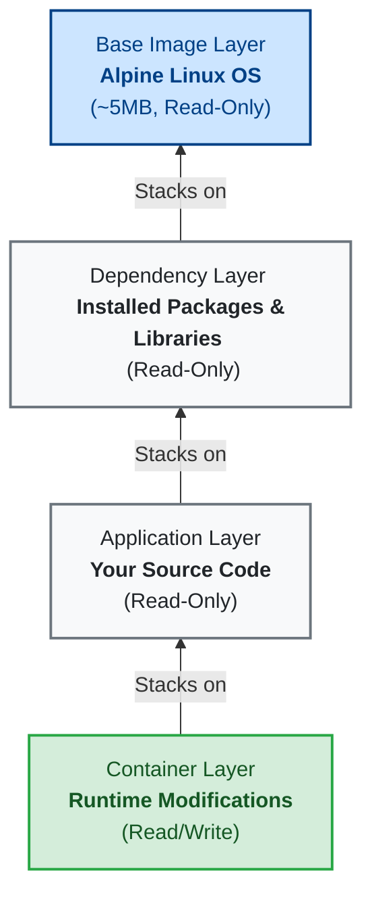

# My Docker Learning Notes
These are my notes as I learn Docker.

## What is Docker?
Docker is an open-source platform that enables developers to build, deploy, run, update, and manage containers. Containers are standardized, executable components that combine application source code with the operating system (OS) libraries and dependencies required to run that code in any environment.

In simpler terms, Docker allows you to package an application and all its dependencies into a single, isolated unit called a container. This ensures that the application runs identically regardless of where the container is deployed (e.g., on a developer's local laptop, a testing server, or in the cloud), eliminating the classic "it works on my machine" problem.

## Images vs. Containers
It is important to understand the fundamental difference between a Docker **Image** and a Docker **Container**:

* **Docker Image:** Think of an image as a **blueprint** or a recipe. It is a static, read-only file that contains the application source code, libraries, dependencies, tools, and other files needed for the application to run. You don't "run" an image directly; instead, you use it to create containers.
* **Docker Container:** A container is the **running instance** of an image. Simply put, **a Docker container is a runtime environment for a Docker image**. If the image is the blueprint, the container is the actual house built from that blueprint. A container has state—it can be started, stopped, paused, and destroyed. You can run multiple containers simultaneously from a single image.

## Docker vs. Virtual Machines (VMs)
While both Docker and VMs provide isolation, they achieve it in fundamentally different ways based on their architectural stack:

* **The Virtual Machine Stack:** `Hardware -> Host OS -> Hypervisor -> Guest OS (Kernel) -> Application`
  * A VM requires a full, heavy **Guest Operating System (kernel)** to be installed and booted for every isolated environment. A VM completely virtualizes the hardware and changing the VM means you are dealing with a completely separate kernel.
* **The Docker Stack:** `Hardware -> Host OS (Kernel) -> Docker Engine -> Application`
  * Docker **shares the host OS kernel** across all running containers. It only virtualizes and isolates the **application layer** (your app code and its specific dependencies). Because it doesn't need to boot a separate kernel for every app, Docker is significantly faster, more lightweight, and uses far less memory than a VM.

## Docker Toolbox
**What is it?** Docker Toolbox is a legacy installer and toolset for older Windows and Mac systems. 
**When to use it?** You generally **should not** use it today unless you are on a very old machine. It was designed for older operating systems that did not meet the requirements for the modern "Docker Desktop" application (specifically, systems that lacked native Hyper-V or Hypervisor framework support). 
**Its Purpose:** Because Docker requires a Linux kernel to run, older Macs and Windows PCs couldn't run it natively. Docker Toolbox solved this by installing Oracle VirtualBox and automatically spinning up a tiny Linux VM in the background. It then ran the Docker Engine *inside* that VM. Today, Docker Desktop uses modern, native virtualization (like WSL2 on Windows) making Toolbox obsolete.

## What is Docker Hub?
Docker Hub is a cloud-based registry service provided by Docker. It is the largest repository of container images in the world. Developers use Docker Hub to find, store, share, and manage container images. When you run a command like `docker pull ubuntu`, Docker automatically connects to Docker Hub to download the `ubuntu` image.

### Docker Repositories
A Docker repository is a collection of related Docker images, often different versions of the same application (distinguished by tags, like `node:14` vs `node:18`).

* **Public Repository:** A public repository is visible and accessible to everyone on the internet. Anyone can search for, download (pull), and use the images stored in a public repository without needing to log in. Docker Hub hosts many official public repositories for popular software like Nginx, Python, and MySQL.
* **Private Repository:** A private repository is restricted and only accessible to authorized users or systems. You need specific credentials (like a username and password or an access token) to view, download (pull), or upload (push) images. This is essential for companies and developers who want to keep their proprietary application code and custom images secure and confidential.

## Docker Image Layers
A Docker image is built up from a series of layers. Each layer represents an instruction in the image's `Dockerfile`. 

### Why Alpine Linux?
You will often see Docker images built on top of **Alpine Linux**. Alpine is a minimal, security-oriented, and extremely lightweight Linux distribution. 
* **Tiny Size:** The base Alpine image is only about **5MB** in size.
* **Why it matters:** Using a tiny base OS drastically reduces the overall size of your Docker images. This leads to faster download/upload times, takes up less disk space, and reduces the "attack surface" (fewer installed packages means fewer potential security vulnerabilities).

### Image Layer Diagram
Below is an illustration of how layers stack on top of each other. The bottom layer is the base OS (like Alpine). Each subsequent change (like installing dependencies or copying your application code) adds a new **read-only** layer. 

When you start a container from the image, Docker adds a thin, temporary **read/write** layer on the very top for any runtime modifications.



## Running an Image Locally
To run an image locally, you use the `docker run` command followed by the image name and its version (which is called a tag).

```bash
docker run <image_name>:<version>
```
*Example: `docker run ubuntu:22.04`*

### Layer Caching & Downloading
When you run or pull an image for the first time, Docker downloads it layer by layer. Because of the layered architecture discussed above, Docker is incredibly efficient with bandwidth and storage. 

If you later download a different version of that same image (e.g., changing from `v1.0` to `v2.0`), Docker will **only download the specific layers that have changed**. Any underlying layers that remain identical between the two versions are instantly reused from your local system cache! This is known as **Layer Caching**.

### Why Tag a Version?
When pulling images from Docker Hub, it is best practice to always specify a **version tag**. If you omit the tag (e.g., `docker pull ubuntu`), Docker defaults to the tag `:latest`.

* **The Danger of `:latest`**: The `:latest` tag is mutable, meaning the image it points to can change over time. If you build your application on Monday using the `:latest` image, and then pull it again on Friday, the `:latest` image might have been updated by the maintainer to a newer version. This could introduce breaking changes or unexpected behavior in your application, even though you didn't change your own code.
* **Reproducibility**: By using a specific version tag (e.g., `ubuntu:22.04` or `nginx:1.21.6`), you ensure **reproducibility**. You lock your application to a specific, immutable snapshot of the base image, guaranteeing that it will behave the same way today as it will tomorrow.

## Docker Ports and Networking

When you run an application inside a container, that application is running in an isolated environment. If a web server inside a container is listening on port `80`, your computer (the "Host") cannot see it by default. To access it, you must **bind** or **map** a port on your host machine to the port inside the container.

### Host Port vs. Container Port
When using the `-p` flag in `docker run -p [HOST_PORT]:[CONTAINER_PORT]`:
* **Host Port:** The port on your physical machine (e.g., your laptop). This is the port you type into your web browser (`localhost:8080`).
* **Container Port:** The internal port that the application inside the container is actively listening on.

### Can multiple containers use the same Container Port?
**YES! Your statement is 100% correct:** *"As long as we bind the containers to different host machine ports, container ports can be the same; they can listen on the same port."*

Because containers are isolated from each other, they don't share the same internal network space. You can run two completely different versions of an application (or two completely different applications entirely) that both think they are listening on port `80`. As long as you map them to **different** ports on your physical Host machine, there is no conflict!

### Port Mapping Diagram
Here is a visual representation of running two different versions of an Nginx web server at the same time. Both containers are internally listening on their own port `80`, but they are mapped to different Host ports.

```mermaid
flowchart LR
    subgraph Host Machine (Your Laptop)
        Browser1["Browser -> localhost:8080"]
        Browser2["Browser -> localhost:8081"]
        
        subgraph Docker Engine
            AppV1["Nginx v1.0 Container<br>Listening on Port 80"]
            AppV2["Nginx v2.0 Container<br>Listening on Port 80"]
        end
    end

    Browser1 == "Traffic hits Host Port 8080" ==> AppV1
    Browser2 == "Traffic hits Host Port 8081" ==> AppV2

    style Host Machine fill:#f9f9f9,stroke:#333,stroke-width:2px
    style Docker Engine fill:#e1f5fe,stroke:#0288d1,stroke-width:2px
    style AppV1 fill:#dcedc8,stroke:#689f38,stroke-width:2px
    style AppV2 fill:#dcedc8,stroke:#689f38,stroke-width:2px
```
