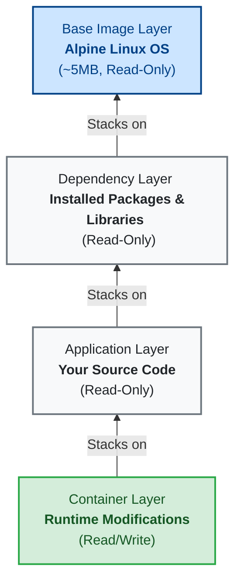

# My Docker Learning Notes
These are my notes as I learn Docker.

## What is Docker?
Docker is an open-source platform that enables developers to build, deploy, run, update, and manage containers. Containers are standardized, executable components that combine application source code with the operating system (OS) libraries and dependencies required to run that code in any environment.

In simpler terms, Docker allows you to package an application and all its dependencies into a single, isolated unit called a container. This ensures that the application runs identically regardless of where the container is deployed (e.g., on a developer's local laptop, a testing server, or in the cloud), eliminating the classic "it works on my machine" problem.

## What is Docker Hub?
Docker Hub is a cloud-based registry service provided by Docker. It is the largest repository of container images in the world. Developers use Docker Hub to find, store, share, and manage container images. When you run a command like `docker pull ubuntu`, Docker automatically connects to Docker Hub to download the `ubuntu` image.

### Docker Repositories
A Docker repository is a collection of related Docker images, often different versions of the same application (distinguished by tags, like `node:14` vs `node:18`).

* **Public Repository:** A public repository is visible and accessible to everyone on the internet. Anyone can search for, download (pull), and use the images stored in a public repository without needing to log in. Docker Hub hosts many official public repositories for popular software like Nginx, Python, and MySQL.
* **Private Repository:** A private repository is restricted and only accessible to authorized users or systems. You need specific credentials (like a username and password or an access token) to view, download (pull), or upload (push) images. This is essential for companies and developers who want to keep their proprietary application code and custom images secure and confidential.

## Docker Image Layers
A Docker image is built up from a series of layers. Each layer represents an instruction in the image's `Dockerfile`. 

### Why Alpine Linux?
You will often see Docker images built on top of **Alpine Linux**. Alpine is a minimal, security-oriented, and extremely lightweight Linux distribution. 
* **Tiny Size:** The base Alpine image is only about **5MB** in size.
* **Why it matters:** Using a tiny base OS drastically reduces the overall size of your Docker images. This leads to faster download/upload times, takes up less disk space, and reduces the "attack surface" (fewer installed packages means fewer potential security vulnerabilities).

### Image Layer Diagram
Below is an illustration of how layers stack on top of each other. The bottom layer is the base OS (like Alpine). Each subsequent change (like installing dependencies or copying your application code) adds a new **read-only** layer. 

When you start a container from the image, Docker adds a thin, temporary **read/write** layer on the very top for any runtime modifications.

